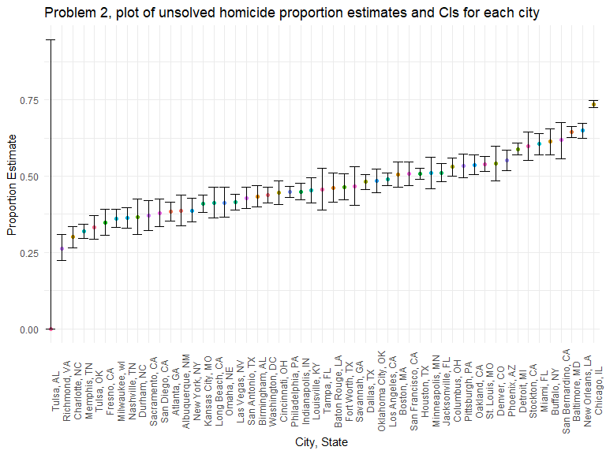
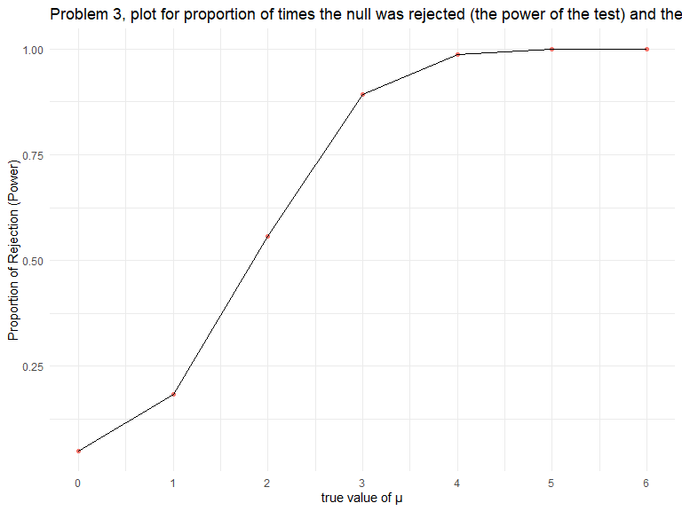
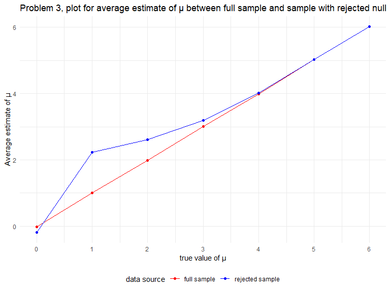

Homework 5 zz2901
================
Troy Zhou

## Problem 1

## Problem 2

The Washington Post has gathered data on homicides in 50 large U.S.
cities and made the data available through a GitHub repository here. You
can read their accompanying article here.

Describe the raw data. Create a city_state variable (e.g. “Baltimore,
MD”) and then summarize within cities to obtain the total number of
homicides and the number of unsolved homicides (those for which the
disposition is “Closed without arrest” or “Open/No arrest”).

``` r
homicide_mut <- homicide_df %>% 
  mutate(victim_age = recode(victim_age,"Unknown"=""),
         victim_age = as.numeric(victim_age),
         city_state = paste0(city, ", ", state))

homicide_sum <- homicide_mut %>% 
  group_by(city_state) %>% 
  summarize(numb_unsolved = sum(disposition == "Closed without arrest" | disposition == "Open/No arrest"),
    total_homicide = n())
```

- The raw data has `52179` observations and `12` variables. After adding
  the new city_state variable, there are `13` variables.

- The `victim_age` variable had some missing observations with
  `Unknown`. As a result it becomes a `chr` type variable.

  - the value was substituted with `NA` and type changed to `num`.

  - there were no other inconsistent data types

- The latitude variable `lat` and longitude variable `lon` had some
  missing values recorded in `NA`.

- The total number of homicides and the number of unsolved homicides for
  each city can be seen in the following table:

| city_state         | numb_unsolved | total_homicide |
|:-------------------|--------------:|---------------:|
| Albuquerque, NM    |           146 |            378 |
| Atlanta, GA        |           373 |            973 |
| Baltimore, MD      |          1825 |           2827 |
| Baton Rouge, LA    |           196 |            424 |
| Birmingham, AL     |           347 |            800 |
| Boston, MA         |           310 |            614 |
| Buffalo, NY        |           319 |            521 |
| Charlotte, NC      |           206 |            687 |
| Chicago, IL        |          4073 |           5535 |
| Cincinnati, OH     |           309 |            694 |
| Columbus, OH       |           575 |           1084 |
| Dallas, TX         |           754 |           1567 |
| Denver, CO         |           169 |            312 |
| Detroit, MI        |          1482 |           2519 |
| Durham, NC         |           101 |            276 |
| Fort Worth, TX     |           255 |            549 |
| Fresno, CA         |           169 |            487 |
| Houston, TX        |          1493 |           2942 |
| Indianapolis, IN   |           594 |           1322 |
| Jacksonville, FL   |           597 |           1168 |
| Kansas City, MO    |           486 |           1190 |
| Las Vegas, NV      |           572 |           1381 |
| Long Beach, CA     |           156 |            378 |
| Los Angeles, CA    |          1106 |           2257 |
| Louisville, KY     |           261 |            576 |
| Memphis, TN        |           483 |           1514 |
| Miami, FL          |           450 |            744 |
| Milwaukee, wI      |           403 |           1115 |
| Minneapolis, MN    |           187 |            366 |
| Nashville, TN      |           278 |            767 |
| New Orleans, LA    |           930 |           1434 |
| New York, NY       |           243 |            627 |
| Oakland, CA        |           508 |            947 |
| Oklahoma City, OK  |           326 |            672 |
| Omaha, NE          |           169 |            409 |
| Philadelphia, PA   |          1360 |           3037 |
| Phoenix, AZ        |           504 |            914 |
| Pittsburgh, PA     |           337 |            631 |
| Richmond, VA       |           113 |            429 |
| Sacramento, CA     |           139 |            376 |
| San Antonio, TX    |           357 |            833 |
| San Bernardino, CA |           170 |            275 |
| San Diego, CA      |           175 |            461 |
| San Francisco, CA  |           336 |            663 |
| Savannah, GA       |           115 |            246 |
| St. Louis, MO      |           905 |           1677 |
| Stockton, CA       |           266 |            444 |
| Tampa, FL          |            95 |            208 |
| Tulsa, AL          |             0 |              1 |
| Tulsa, OK          |           193 |            583 |
| Washington, DC     |           589 |           1345 |

For the city of Baltimore, MD, use the prop.test function to estimate
the proportion of homicides that are unsolved; save the output of
prop.test as an R object, apply the broom::tidy to this object and pull
the estimated proportion and confidence intervals from the resulting
tidy dataframe.

``` r
baltimore_test <- homicide_sum %>%
  filter(city_state == "Baltimore, MD") 

baltimore_output <- prop.test(baltimore_test$numb_unsolved, baltimore_test$total_homicide) %>% 
  broom::tidy()

baltimore_output %>% 
  pull(estimate)
```

    ##         p 
    ## 0.6455607

``` r
baltimore_output %>% 
  pull(conf.low)
```

    ## [1] 0.6275625

``` r
baltimore_output %>% 
  pull(conf.high)
```

    ## [1] 0.6631599

- The object `baltimore_output` containing the tidy output was created.
  The estimated proportion was `0.6275625`, the confidence interval was
  (`0.6275625`, `0.6275625`)

Now run prop.test for each of the cities in your dataset, and extract
both the proportion of unsolved homicides and the confidence interval
for each. Do this within a “tidy” pipeline, making use of purrr::map,
purrr::map2, list columns and unnest as necessary to create a tidy
dataframe with estimated proportions and CIs for each city.

``` r
homicide_prop <- homicide_sum %>% 
  mutate(proportion = purrr::map2(numb_unsolved, total_homicide, prop.test),
         proportion = purrr::map(proportion, broom::tidy)) %>% 
  unnest(proportion) %>% 
  select(1:4, 8, 9)
```

- A tidy dataframe with estimated proportions and CIs for each city was
  created and called `homicide_prop`.

``` r
homicide_prop
```

    ## # A tibble: 51 × 6
    ##   city_state      numb_unsolved total_homicide estimate conf.low conf.high
    ##   <chr>                   <int>          <int>    <dbl>    <dbl>     <dbl>
    ## 1 Albuquerque, NM           146            378  0.38624  0.33726   0.43758
    ## 2 Atlanta, GA               373            973  0.38335  0.35281   0.41482
    ## 3 Baltimore, MD            1825           2827  0.64556  0.62756   0.66316
    ## 4 Baton Rouge, LA           196            424  0.46226  0.41420   0.51102
    ## 5 Birmingham, AL            347            800  0.43375  0.39919   0.46896
    ## # … with 46 more rows
    ## # ℹ Use `print(n = ...)` to see more rows

Create a plot that shows the estimates and CIs for each city – check out
geom_errorbar for a way to add error bars based on the upper and lower
limits. Organize cities according to the proportion of unsolved
homicides.

``` r
homicide_prop %>% 
  ggplot(aes(reorder(city_state,estimate), estimate)) +       
  geom_point(aes(color=city_state)) +
  geom_errorbar(aes(ymin = conf.low, ymax = conf.high))+
    labs(
    title = "Problem 2, plot of unsolved homicide proportion estimates and CIs for each city ",
    x = "City, State",
    y = "Proportion Estimate") +
   theme(axis.text.x = element_text(angle = 90),
         legend.position = "none")
```



## Problem 3

When designing an experiment or analysis, a common question is whether
it is likely that a true effect will be detected – put differently,
whether a false null hypothesis will be rejected. The probability that a
false null hypothesis is rejected is referred to as power, and it
depends on several factors, including: the sample size; the effect size;
and the error variance. In this problem, you will conduct a simulation
to explore power in a one-sample t-test.

First set the following design elements: Fix n=30; Fix σ=5

Set μ=0. Generate 5000 datasets from the model: x∼Normal\[μ,σ\]

For each dataset, save μ^ and the p-value arising from a test of H:μ=0
using α=0.05. Hint: to obtain the estimate and p-value, use broom::tidy
to clean the output of t.test.

``` r
sim_test <- function(mu,n = 30, sigma = 5){
    sim_data = tibble(
    x = rnorm(n = n, mean = mu, sd = sigma),
    )
    
    sim_data <- t.test(sim_data) %>% 
      broom::tidy() %>% 
      select(estimate,p.value)
      
}

sim_results_df = 
  expand_grid(
    mu_value = 0,
    iter = 1:5000
  ) %>% 
  mutate(
    estimate_df = map(mu_value, sim_test)
  ) %>% 
  unnest(estimate_df)

sim_results_df
```

    ## # A tibble: 5,000 × 4
    ##   mu_value  iter estimate  p.value
    ##      <dbl> <int>    <dbl>    <dbl>
    ## 1        0     1  1.4086  0.11044 
    ## 2        0     2 -0.92021 0.36409 
    ## 3        0     3 -0.59712 0.50513 
    ## 4        0     4 -1.8818  0.051827
    ## 5        0     5 -2.6281  0.010118
    ## # … with 4,995 more rows
    ## # ℹ Use `print(n = ...)` to see more rows

- The simulated results containing the estimate and p-valueis was stored
  in the dataset `sim_results_df` with `5000` observations.

Repeat the above for μ={1,2,3,4,5,6}, and complete the following:

``` r
sim_results_mu = 
  expand_grid(
    mu_value = 1:6,
    iter = 1:5000
  ) %>% 
  mutate(
    estimate_df = map(mu_value, sim_test)
  ) %>% 
  unnest(estimate_df)

sim_results_mu <- rbind(sim_results_df,sim_results_mu)

sim_results_mu
```

    ## # A tibble: 35,000 × 4
    ##   mu_value  iter estimate  p.value
    ##      <dbl> <int>    <dbl>    <dbl>
    ## 1        0     1  1.4086  0.11044 
    ## 2        0     2 -0.92021 0.36409 
    ## 3        0     3 -0.59712 0.50513 
    ## 4        0     4 -1.8818  0.051827
    ## 5        0     5 -2.6281  0.010118
    ## # … with 34,995 more rows
    ## # ℹ Use `print(n = ...)` to see more rows

- The simulated results for μ={0,1,2,3,4,5,6} containing the estimate
  and p-valueis was stored in the dataset `sim_results_mu` with `35000`
  observations.

Make a plot showing the proportion of times the null was rejected (the
power of the test) on the y axis and the true value of μ on the x axis.
Describe the association between effect size and power.

``` r
sim_results_mu %>% 
  group_by(mu_value) %>% 
  summarize(reject_prop = sum(p.value < 0.05)/n()) %>% 
  ggplot(aes(x = mu_value, y = reject_prop)) +
  geom_point(aes(color="Red")) +
  geom_line() + 
  scale_x_continuous(breaks=seq(0,6,by=1))+
    labs(
    title = "Problem 3, plot for proportion of times the null was rejected (the power of the test) and the true value of μ",
    x = "true value of μ",
    y = "Proportion of Rejection (Power)")+
   theme(legend.position = "none")
```



- From the plot above, we can observe a clear positive relationship
  between the effect size and power, or power increases as effect size
  increases.

  - However, as power approaches 1, increasing effect size would have
    diminishing returns, which is observed after mu=3.

Make a plot showing the average estimate of μ^ on the y axis and the
true value of μ on the x axis. Make a second plot (or overlay on the
first) the average estimate of μ^ only in samples for which the null was
rejected on the y axis and the true value of μ on the x axis. Is the
sample average of μ^ across tests for which the null is rejected
approximately equal to the true value of μ? Why or why not?

``` r
mean_estimate <- sim_results_mu %>% 
  group_by(mu_value) %>% 
  summarize(mean_prop = mean(estimate))

mean_estimate_rej <- sim_results_mu %>% 
  filter(p.value < 0.05) %>% 
  group_by(mu_value) %>% 
  summarize(mean_prop = mean(estimate))

ggplot(mean_estimate, aes(x = mu_value, y = mean_prop, color = "a")) +
  geom_point() +
  geom_line() +
  geom_point(data = mean_estimate_rej, aes(x = mu_value, y = mean_prop, color = "b")) +
  geom_line(data = mean_estimate_rej, aes(x = mu_value, y = mean_prop, color = "b"))+
      scale_color_manual(name = 'data source',
                         values =c('a'='Red','b'='Blue'), 
                     labels = c('full sample','rejected sample'))+
    labs(
    title = "Problem 3, plot for average estimate of μ between full sample and sample with rejected null",
    x = "true value of μ",
    y = "Average estimate of μ")+ 
  scale_x_continuous(breaks=seq(0,6,by=1))
```



- The sample average of estimated μ across tests for which the null is
  rejected is not approximately equal to the true value of μ at lower
  true values of μ. They are approximately equal when true μ equals to 0
  and at larger true values of μ.

  - This can be seen from the nearly perfect linear relationship from
    the full sample line, from which the rejected sample line deviated.

- The slight differences at lower true values of μ are caused by the
  lower power at lower true values of μ. Not all samples are correctly
  rejected at lower power, which caused the mean μ to deviated from the
  true values of μ.
